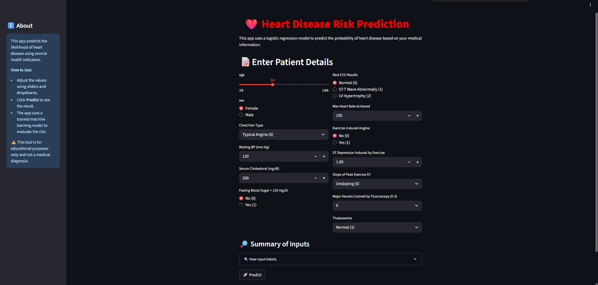
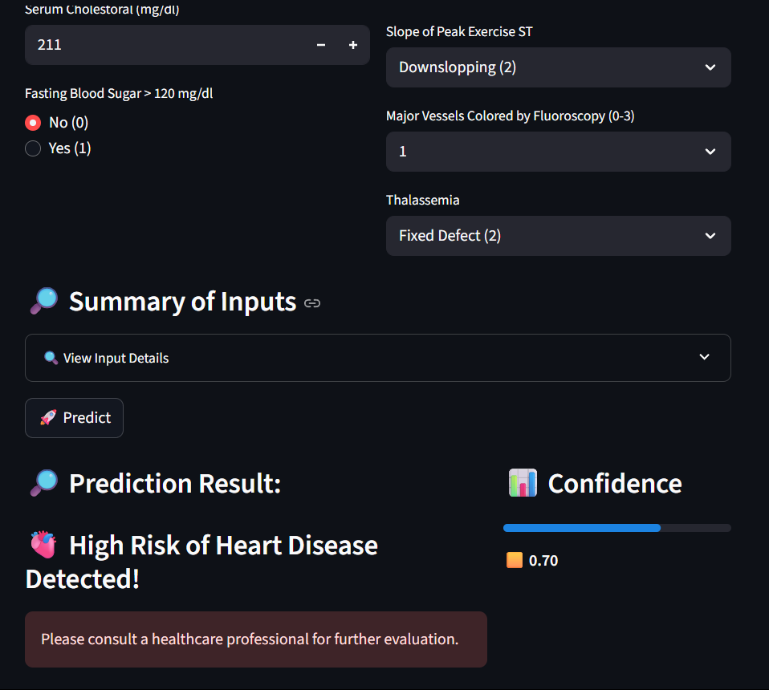

# ❤️ Heart Disease Prediction App

A simple and interactive web app that predicts whether a person is at **high or low risk** of heart disease based on medical parameters, using a Machine Learning model built in Python.
## 🚀 Live Demo

Experience the app live 👉 [Heart Disease Risk Predictor](https://heart-disease-app-9tjbz6xoedfgzqbrjaekgs.streamlit.app/)

### 🧪 Sample Test Case

**high-risk** prediction:
58, 1, 2, 140, 211, 0, 1, 100, 1, 2.6, 2, 1, 2

**low-risk** prediction:
41, 0, 0, 120, 157, 0, 1, 182, 0, 0.0, 1, 0, 0

---

## 🚀 Features

- 🔢 Predicts heart disease risk using clinical data
- 📈 Uses a trained machine learning model
- 🧠 Built with Streamlit for fast and interactive UI
- 💾 Deployable and lightweight
- 📤 Export predictions to CSV

---

## 🧪 Inputs Used for Prediction

The app uses the following 13 features from the [Cleveland Heart Disease dataset](https://archive.ics.uci.edu/ml/datasets/heart+Disease):

| Feature | Description |
|--------|-------------|
| age | Age of the patient |
| sex | Gender (1 = male, 0 = female) |
| cp | Chest pain type (0–3) |
| trestbps | Resting blood pressure |
| chol | Serum cholesterol |
| fbs | Fasting blood sugar > 120 mg/dl |
| restecg | Resting electrocardiographic results |
| thalach | Max heart rate achieved |
| exang | Exercise-induced angina |
| oldpeak | ST depression |
| slope | Slope of the ST segment |
| ca | Major vessels (0–3) colored by fluoroscopy |
| thal | Thalassemia (1 = normal; 2 = fixed defect; 3 = reversible defect) |

---

## 🤖 Model Details

- 📚 Algorithm: Trained Logistic Regression model (built via scikit-learn)
- 🧠 Trained on: `processed.cleveland.data`
- 🛠 Libraries used: `scikit-learn`, `pandas`, `numpy`, `joblib`

---

## 📸 Screenshot

 

### 📊 Prediction Output



### 📤 CSV Export


---

## 🛠 Setup & Run Locally

```bash
# Clone the repository
git clone https://github.com/Ankit2729/heart-disease-app.git
cd heart-disease-app

# Install dependencies
pip install -r requirements.txt

# Run the Streamlit app
streamlit run app.py

```
## 🤝 Contributing

Contributions, issues, and feature requests are welcome!  
Feel free to fork the repo and submit a pull request.

If you liked this project, a ⭐️ would mean a lot!


## 👤 Author

**Ankit Kumar**

- GitHub: [@Ankit2729](https://github.com/Ankit2729)


